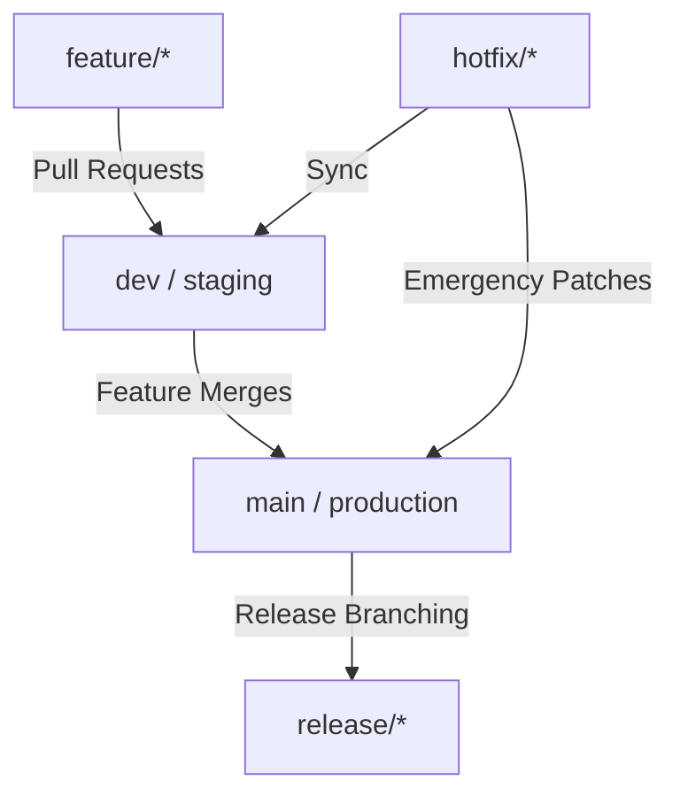

# Git Branching Strategy and Governance

This document outlines the Git branching strategy, workflow, and branch governance rules for the Global Digital Bank (GDB) platform development and deployment.

---

## 1. Branch Hierarchy

### 1.1 Core Branches
- **`main`**: Represents production-ready code. The source code on `main` is always stable and mirrors what is deployed in production. Directly committing to `main` is strictly prohibited.
- **`dev`**: The integration branch for features. Developers merge their features here for QA testing and integration. It acts as the pre-production/staging codebase.

### 1.2 Supporting Branches
- **`feature/*`**: Used for developing new features or enhancements. Branch names should follow the pattern `feature/JIRA-ID-short-desc` (e.g., `feature/GDB-101-auth-jwt`). Created from `dev` and merged back into `dev` via Pull Requests.
- **`release/*`**: Created from `dev` when preparing for a production release. Bug fixes found during release testing are committed here and merged back to `dev` and `main` upon release.
- **`hotfix/*`**: Used for emergency production fixes. Branches are created from `main`, fixed, and merged into both `main` and `dev`.

---

## 2. Pull Request (PR) Workflow

To merge code from `feature/*` to `dev`, or from `dev` to `main`, developers must follow the PR workflow:

1. **Local Development**: Developer works on `feature/feature-name` branch.
2. **Push to Remote**: Push feature branch to the central repository.
3. **Open PR**: Create a Pull Request targeting `dev`.
4. **Code Review**: At least one senior engineer must review the PR.
5. **CI/CD Checks**: The automated pipeline must run and pass all test suites.
6. **Merge**: Once reviews are approved and CI checks pass, the PR is merged into `dev`.

---

## 3. Branch Protection Rules

The following protection rules must be applied to `main` and `dev` branches on GitHub/GitLab:

- **Require Pull Request reviews before merging**: At least 1 approving review is required.
- **Require status checks to pass before merging**: Build, unit tests, and security analysis must pass.
- **Require signed commits**: All commits must be GPG signed to verify identity.
- **Restrict who can push**: Direct pushes are disabled for all developers, including admins (requires PR to merge).
- **Dismiss stale pull request approvals**: Approvals are reset if new commits are pushed.
